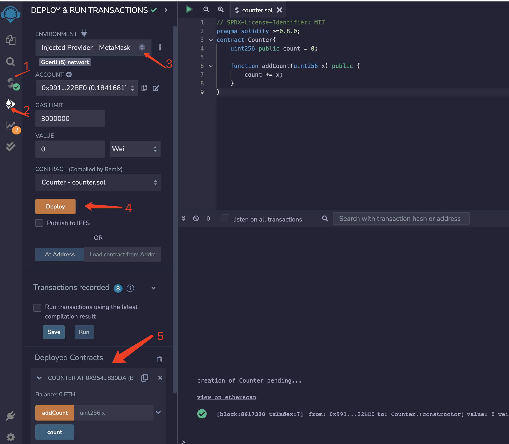

## 作业一: 安装Metamask、并创建好账号
#### ETH钱包地址1: 0x991386713789569042EF3D9C882e8be4b4122BE0


## 作业二：执行一次转账
#### From: 0x991386713789569042EF3D9C882e8be4b4122BE0
#### To: 0x765D1744bfb11F48c8E84C6A9464c028c78cB78F
#### 交易hash: 0xf96bb87b1d029a73512877147275d411cbe08a37fffb9acae5fbe91ebdd71fae
#### 交易url：[https://goerli.etherscan.io/tx/0xf96bb87b1d029a73512877147275d411cbe08a37fffb9acae5fbe91ebdd71fae](https://goerli.etherscan.io/tx/0xf96bb87b1d029a73512877147275d411cbe08a37fffb9acae5fbe91ebdd71fae)

## 作业三：使用Remix创建一个Counter合约并部署（包含add方法）
``` solidity
pragma solidity >=0.8.0;
contract Counter{
    uint256 public count = 0;

    function addCount(uint256 x) public {
        count += x;
    }
}
```



## 备忘
* 测试网浏览器: https://goerli.etherscan.io/
* 正式网浏览器: https://etherscan.io/